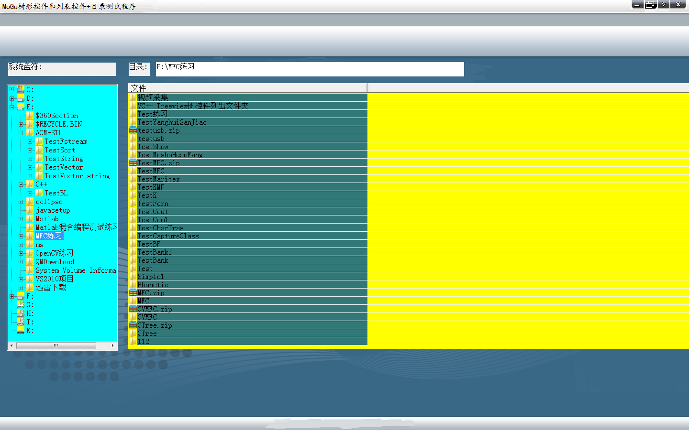

#项目说明:

> 这是一个类似于Windows文档管理器的程序,提供了从始至终,都是动态创建界面的宗旨,动态创建界面具有三态变化的按钮控制,所有界面设备无关位图dib全是自己手工制作,标题是通过在程序中读取配置文件mogu.ini,从中获得project的标题,以后如果需要换标题,只需要修改配置文件即可.此外,我还通过程序实现了枚举系统盘符的功能,该功能能够动态检测外接设备如U盘或者移动硬盘的盘符,进而获得盘符下的文件和目录结构,最后根据你的选择动态在ListView中显示该盘符或者文件夹下的文件,并在目录右侧编辑框内,动态显示你选择的文件路径.

##界面

